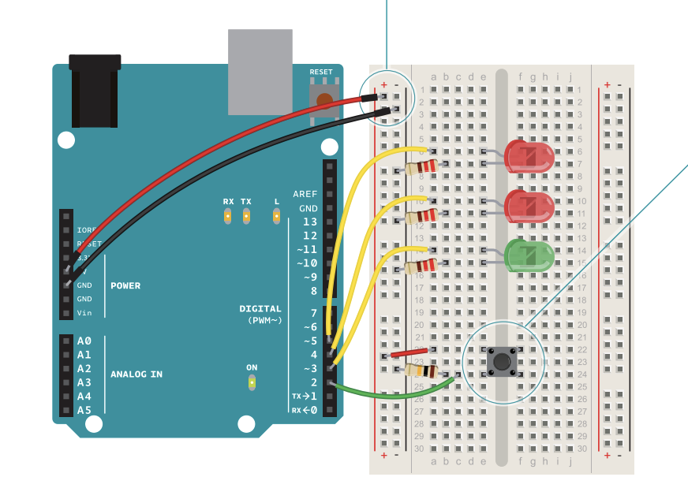
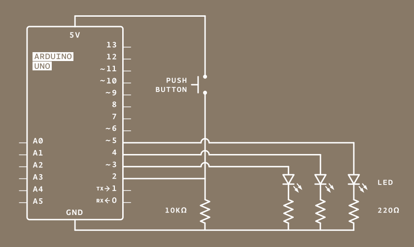

# Spaceship Interface

Spaceship Interface will lead us through the process of creating a programmable LED light show at the touch of a button!

---
## Wiring
First thing's first, we need to wire up our Arduino and breadboard. Here's a picture of the wiring diagram and schematic:




In the pictures you can see that we're using the standard 5v power supply of the Arduino, connecting it and ground at the top
of the breadboard so both power and ground are available all the way down. There are also 3 LED's that are connected to
control pins on the board (that will let us programatically determine when they get power), before being fed to ground through a
220Ω resistor.

There is also a switch wired up, which is what we'll be using to send a signal to our program. The green wire is connected to
input pin 2 on the Arduino, and that 10kΩ resistor is functioning as a **pull-down** resistor.

>The pull-down resistor holds the logic signal near to zero volts (0V) when no other active device is connected.
It pulls the input voltage down to the ground to prevent an undefined state at the input.

So as long as our circuit remains open and the switch is un-pressed, that resistor connects pin 2 to ground so that it won't accidentaly send a false-input state back to the board.

---
## Code
If you're familiar with `if` statements in any launguage, the code for this project is pretty straightforward. However, since this is the first of these project breakdowns I'm doing, let's talk about a couple of things that every Arduino sketch, or program, needs.

Every Arduino sketch contains a `setup()` and a `loop()` function. Setup runs when the the unit boots, and is used to initialize important variables and settings. Loop runs continuously after setup, so that's where the bulk of our code will be.

```
int switchState = 0;

void setup() {`
  pinMode(3, OUTPUT);
  pinMode(4, OUTPUT);
  pinMode(5, OUTPUT);
  pinMode(2, INPUT);

}
```

In the above snippet, we initialize a variable to hold the state of our switch, set to `0` to indicate a false or "not pressed" state. Then in `setup()` we indicate the mode for each pin we'll be using. Since pins 3 - 5 are being used for our LED's, we set those to `OUTPUT` and set pin 2 to `INPUT`.

```
void loop() {

  switchState = digitalRead(2);

  if (switchState == LOW) {
    // send 5v to the green LED (on pin 3)
    digitalWrite(3, HIGH);
    digitalWrite(4, LOW);
    digitalWrite(5, LOW);

  } else {
    // turn off green LED and turn on one red LED
    digitalWrite(3, LOW);
    digitalWrite(4, LOW);
    digitalWrite(5, HIGH);

    // wait 250ms
    delay(250);

    // switch the red LED's
    digitalWrite(4, HIGH);
    digitalWrite(5, LOW);

    // wait 250ms
    delay(250);
  }
}
```

Now we're in the `loop()` function. The first thing `loop()` does is use an Arduino function called `digitalRead()` to check the state of pin 2 and store the result of that function in the previously declared `switchState` variable. `digitalRead()` returns a number: `1`, indicating `HIGH` (the presence of voltage), or `0`, indicating `LOW` (the absence of voltage).

The loop continues with some conditionals, that will interpret the state of the switch to perform a defined action. If `switchState = LOW` (the switch is not pressed), the `digitalWrite()` function is used to send 5V to the green LED, but nothing to the red LED's. Otherwise (if the switch is pressed), `digitalWrite()` is used to turn off the green LED and turn on only one of the red LED's.

Then the `delay()` function is used, which has the program wait for an amount of time, in this case 250ms, before using `digitalWrite()` again to swap the active red LED's. The program then waits an additional 250ms before repeating.

The gif below shows how this looks in practice!


There are many different ways to to program `loop()` to achieve a variety of fun effects. Maybe the red LED's blink much faster, or maybe the green blinks with them as well. Perhaps all three blink in unison? Play around and have fun.